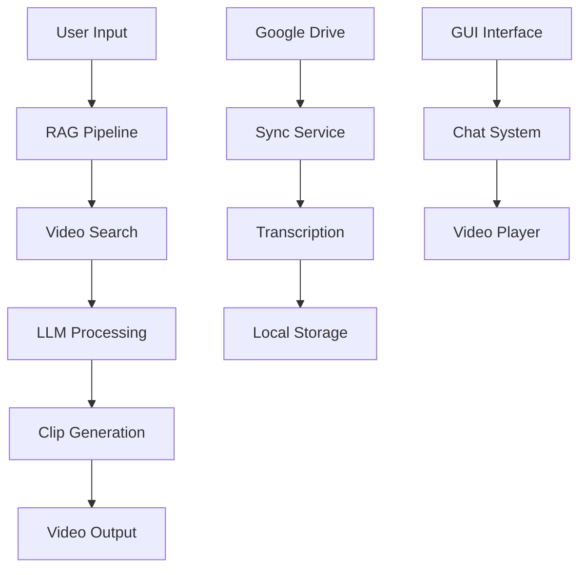

# 🎬 ClipQuery - AI-Powered Video Chatbot

<div align="center">


**Transform your videos into interactive conversations with AI**

[](https://www.python.org/downloads/)
[](https://ffmpeg.org/)
[](https://groq.com/)
[](LICENSE)

</div>

---

## 🚀 Overview

ClipQuery is an intelligent video chatbot that transforms your video content into interactive conversations. Using advanced AI and RAG (Retrieval-Augmented Generation) technology, it can:

- **🎯 Semantic Video Clipping**: Extract precise video segments based on natural language queries
- **🤖 AI-Powered Conversations**: Chat with your videos using natural language
- **☁️ Google Drive Integration**: Automatic sync and transcription of videos
- **📝 Smart Transcription**: Automatic generation of transcripts and subtitles
- **🎨 Modern GUI**: Beautiful, intuitive interface built with CustomTkinter

---

## ✨ Key Features

### 🎬 Intelligent Video Clipping
- **Semantic Search**: Find video segments using natural language
- **Smart Time Ranges**: Automatically detect natural clip boundaries
- **Multi-Video Support**: Search across multiple videos simultaneously
- **Acronym Detection**: Special handling for acronyms and definitions

### 🤖 AI Conversation
- **Context-Aware Responses**: Understands conversation history
- **Multi-Modal Queries**: Handle both general questions and clipping requests
- **Groq Integration**: Fast, reliable AI responses using Groq's API

### ☁️ Google Drive Sync
- **Automatic Sync**: Real-time synchronization with Google Drive
- **Batch Processing**: Handle multiple videos efficiently
- **Transcription Pipeline**: Automatic Whisper transcription
- **Cloud Storage**: Seamless cloud-to-local workflow

### 🎨 Modern Interface
- **Responsive Design**: Beautiful, modern GUI
- **Real-time Updates**: Live sync status and progress indicators
- **Video Preview**: Built-in video player integration
- **Dark/Light Mode**: Customizable appearance

---

## 🛠️ Installation

### Prerequisites

```bash
# Install Python 3.8 or higher
python --version

# Install FFmpeg (required for video processing)
# Windows: Download from https://ffmpeg.org/download.html
# macOS: brew install ffmpeg
# Linux: sudo apt install ffmpeg
```

### Setup

1. **Clone the repository**
```bash
git clone https://github.com/anantterkar/ClipQuery.git
cd ClipQuery
```

2. **Install dependencies**
```bash
pip install -r requirements.txt
```

3. **Set up Google Drive credentials**
```bash
# Place your Google Drive credentials.json file in the project root
# Follow the setup instructions in google_drive_sync.py
```

4. **Configure API keys**
```bash
# Set your Groq API key in latest_chatbot_mohal.py
# Get your API key from: https://console.groq.com/
```

---

## 🚀 Quick Start

### 1. Launch the Application
```bash
python latest_chatbot_mohal.py
```

### 2. Upload Videos
- Click **"📂 Upload Video"** to add local videos
- Or use **Google Drive sync** for cloud videos

### 3. Start Chatting
- Ask general questions about your videos
- Use **"clipping:"** prefix for video clip requests
- Example: `"clipping: Show me the part about insurance claims"`

### 4. Generate Clips
- The system will automatically:
  - Find relevant video segments
  - Generate precise time ranges
  - Create smooth video clips
  - Concatenate multiple clips if needed

---

## 📖 Usage Examples

### General Questions
```
User: "What does this video cover about insurance?"
Vivi: [Provides comprehensive summary with timestamps]
```

### Video Clipping
```
User: "clipping: Show me the explanation of NOPP acronym"
Vivi: [Generates precise video clip with complete acronym explanation]
```

### Multi-Video Search
```
User: "clipping: Find all discussions about surgery procedures"
Vivi: [Searches across all videos and creates relevant clips]
```

---

## 🏗️ Architecture

<div align="center">



</div>

---

## 🔧 Configuration

### Environment Variables
```bash
GROQ_API_KEY=your_groq_api_key_here
GOOGLE_DRIVE_CREDENTIALS=path_to_credentials.json
```

### Video Processing Settings
- **Max Clip Duration**: 300 seconds (configurable)
- **Frame Rate**: 30 FPS (standardized)
- **Codec**: H.264 video, AAC audio
- **Quality**: CRF 23 (good quality)

---

## 📁 Project Structure

```
ClipQuery/
├── latest_chatbot_mohal.py    # Main application
├── rag_pipeline.py            # RAG and search engine
├── google_drive_sync.py       # Google Drive integration
├── requirements.txt           # Python dependencies
├── Max Life Videos/           # Video storage
├── streamlit_UI/             # Alternative web interface
└── README.md                 # This file
```

---

## 🤝 Contributing

We welcome contributions! Please see our [Contributing Guidelines](CONTRIBUTING.md) for details.

### Development Setup
```bash
# Create virtual environment
python -m venv venv
source venv/bin/activate  # On Windows: venv\Scripts\activate

# Install development dependencies
pip install -r requirements.txt
pip install -r requirements-dev.txt  # If available
```

---

## 📄 License

This project is licensed under the MIT License - see the [LICENSE](LICENSE) file for details.

---

## 🙏 Acknowledgments

- **Groq** for fast AI inference
- **OpenAI Whisper** for transcription
- **FFmpeg** for video processing
- **CustomTkinter** for the beautiful GUI
- **Google Drive API** for cloud integration

---

## 📞 Support

- **Issues**: [GitHub Issues](https://github.com/anantterkar/ClipQuery/issues)
- **Discussions**: [GitHub Discussions](https://github.com/anantterkar/ClipQuery/discussions)
- **Email**: [Your Email]

---

<div align="center">

**Made with ❤️ by the ClipQuery Team**

[](https://github.com/anantterkar/ClipQuery)
[](https://github.com/anantterkar/ClipQuery)

</div>

---

<style>
/* Modern CSS styling for GitHub README */
body {
    font-family: -apple-system, BlinkMacSystemFont, 'Segoe UI', 'Roboto', sans-serif;
    line-height: 1.6;
    color: #24292e;
}

h1, h2, h3, h4, h5, h6 {
    color: #0366d6;
    font-weight: 600;
    margin-top: 24px;
    margin-bottom: 16px;
}

h1 {
    font-size: 2em;
    border-bottom: 1px solid #eaecef;
    padding-bottom: 0.3em;
}

h2 {
    font-size: 1.5em;
    border-bottom: 1px solid #eaecef;
    padding-bottom: 0.3em;
}

code {
    background-color: rgba(27, 31, 35, 0.05);
    border-radius: 3px;
    font-size: 85%;
    margin: 0;
    padding: 0.2em 0.4em;
}

pre {
    background-color: #f6f8fa;
    border-radius: 6px;
    font-size: 85%;
    line-height: 1.45;
    overflow: auto;
    padding: 16px;
}

pre code {
    background-color: transparent;
    border: 0;
    display: inline;
    line-height: inherit;
    margin: 0;
    overflow: visible;
    padding: 0;
    word-wrap: normal;
}

blockquote {
    border-left: 0.25em solid #dfe2e5;
    color: #6a737d;
    margin: 0;
    padding: 0 1em;
}

table {
    border-collapse: collapse;
    border-spacing: 0;
    width: 100%;
    overflow: auto;
    display: block;
}

table th, table td {
    border: 1px solid #dfe2e5;
    padding: 6px 13px;
}

table th {
    background-color: #f6f8fa;
    font-weight: 600;
}

img {
    max-width: 100%;
    height: auto;
}

.badge {
    display: inline-block;
    padding: 0.25em 0.4em;
    font-size: 75%;
    font-weight: 700;
    line-height: 1;
    text-align: center;
    white-space: nowrap;
    vertical-align: baseline;
    border-radius: 0.25rem;
}

.badge-blue { background-color: #007bff; color: white; }
.badge-green { background-color: #28a745; color: white; }
.badge-orange { background-color: #fd7e14; color: white; }
.badge-yellow { background-color: #ffc107; color: #212529; }
</style>
