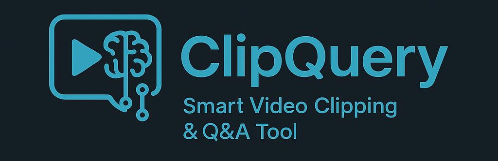

# ClipQuery - Video Chatbot with RAG Pipeline


A powerful video chatbot that uses Retrieval-Augmented Generation (RAG) to answer questions about video content and create video clips based on semantic queries.

## Features

- 🎬 **Video Transcription**: Automatic transcription using OpenAI Whisper
- 🔍 **RAG Pipeline**: Semantic search through video transcripts using ChromaDB and sentence transformers
- ✂️ **Video Clipping**: Create video clips based on semantic queries
- 💬 **Chat Interface**: Modern GUI built with CustomTkinter
- 🤖 **LLM Integration**: Powered by Ollama with Gemma3 model
- 🎥 **Video Processing**: FFmpeg-based video manipulation

## Prerequisites

### 1. Python Dependencies
Install all required Python packages:
```bash
pip install -r requirements.txt
```

### 2. Ollama Setup
Install Ollama from [https://ollama.ai/](https://ollama.ai/) and pull the required model:
```bash
ollama pull gemma3
```

### 3. FFmpeg Installation
Install FFmpeg for video processing:

**Windows:**
```bash
choco install ffmpeg
```

**macOS:**
```bash
brew install ffmpeg
```

**Ubuntu/Debian:**
```bash
sudo apt install ffmpeg
```

### 4. Transcript Files
Place your video transcript files in the `Max Life Videos/` folder. Each transcript should be a `.txt` file with the format:
```
[0.00 - 5.00] This is the first segment of the video
[5.00 - 10.00] This is the second segment of the video
...
```

## Running the Chatbot

### Option 1: Using the Helper Script (Recommended)
```bash
python run_chatbot.py
```

This script will:
- Check all dependencies
- Verify Ollama is running
- Check FFmpeg availability
- Validate transcript files
- Start the chatbot

### Option 2: Direct Execution
```bash
python Chatbot2.py
```

## Usage

### Basic Chat
- Type your questions in the chat interface
- The chatbot will search through all video transcripts to find relevant information
- Responses include timestamps from the source videos

### RAG Search
Use the `rag:` prefix to search for specific content:
```
rag: What does the video say about insurance?
```

### Video Clipping
Use the `video clipping:` prefix to create video clips:
```
video clipping: Show me segments about retirement planning
```

**Note:** You must upload a video first using the "Upload Video" button for clipping to work.

### Commands
- `exit` - Close the application

## File Structure

```
ClipQuery/
├── Chatbot2.py              # Main chatbot application
├── rag_pipeline.py          # RAG pipeline implementation
├── run_chatbot.py           # Helper script for setup and execution
├── requirements.txt         # Python dependencies
├── Max Life Videos/         # Transcript files folder
│   ├── Video 1.txt
│   ├── Video 2.txt
│   └── ...
└── vector_store/            # ChromaDB vector store (auto-generated)
```

## Troubleshooting

### Common Issues

1. **Ollama Connection Error**
   - Ensure Ollama is running: `ollama serve`
   - Check if gemma3 model is installed: `ollama list`

2. **FFmpeg Not Found**
   - Install FFmpeg and add it to your system PATH
   - Restart your terminal/command prompt

3. **Missing Dependencies**
   - Run: `pip install -r requirements.txt`
   - For Windows users, you might need Visual C++ build tools

4. **No Transcript Files Found**
   - Create the `Max Life Videos` folder
   - Add `.txt` transcript files with proper timestamp format

5. **ChromaDB Issues**
   - Delete the `vector_store` folder to reset the database
   - Restart the application

### Performance Tips

- Use the "medium" Whisper model for better transcription quality
- Adjust `similarity_threshold` in the code for more/less strict RAG results
- Limit the number of videos processed simultaneously for better performance

## Development

### Adding New Features
1. The RAG pipeline is in `rag_pipeline.py`
2. The main GUI is in `Chatbot2.py`
3. Add new LLM prompts in the template section
4. Extend the VideoRAG class for additional functionality

### Customizing Models
- Change the Ollama model in `Chatbot2.py` line 82
- Modify the embedding model in `rag_pipeline.py` line 25
- Adjust Whisper model size in `Chatbot2.py` line 285

## License

This project is open source. Feel free to modify and distribute according to your needs.
