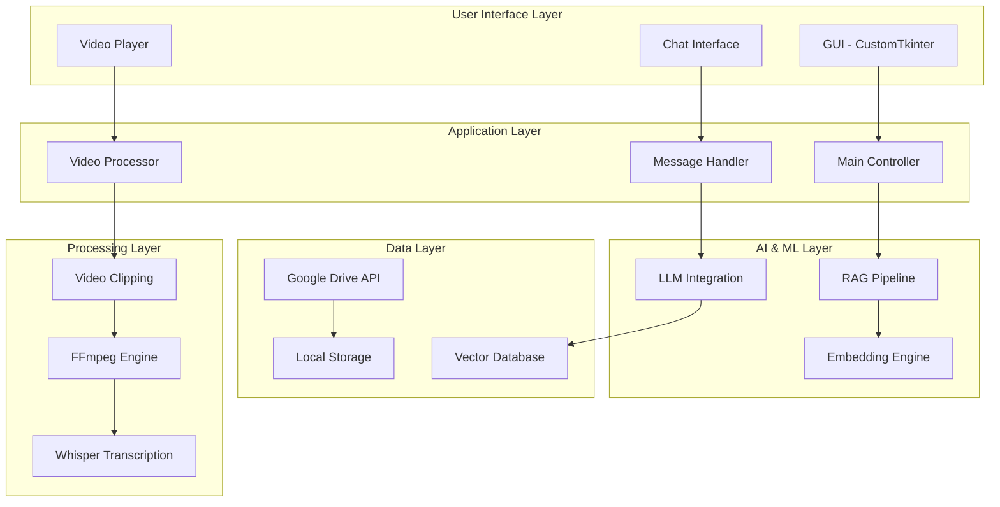

# 📚 ClipQuery Technical Documentation

<div align="center">

**Comprehensive Guide to ClipQuery's Core Architecture**

*Understanding the inner workings of our AI-powered video chatbot*

[](https://github.com/anantterkar/ClipQuery)
[](https://github.com/anantterkar/ClipQuery)
[](https://github.com/anantterkar/ClipQuery)

</div>

---

## 📋 Table of Contents

1. [🏗️ System Architecture](#-system-architecture)
2. [🤖 Main Application (`latest_chatbot_mohal.py`)](#-main-application-latest_chatbot_mohalpy)
3. [🔍 RAG Pipeline (`rag_pipeline.py`)](#-rag-pipeline-rag_pipelinepy)
4. [☁️ Google Drive Sync (`google_drive_sync.py`)](#-google-drive-sync-google_drive_syncpy)
5. [🔧 Core Functions Deep Dive](#-core-functions-deep-dive)
6. [⚙️ Configuration & Optimization](#-configuration--optimization)
7. [🐛 Troubleshooting Guide](#-troubleshooting-guide)

---

## 🏗️ System Architecture

<div align="center">



</div>

---

## 🤖 Main Application (`latest_chatbot_mohal.py`)

### 📁 File Overview
The main application file contains the GUI interface, chat logic, and orchestrates all system components.

### 🏛️ Class Structure

#### `ViviChatbot` Class
The main application class that handles the entire system.

```python
class ViviChatbot:
    def __init__(self):
        # Initialize GUI components
        # Set up Google Drive sync
        # Initialize RAG pipeline
```

### 🔧 Key Methods

#### 1. **Initialization Methods**

##### `__init__()`
```python
def __init__(self):
    # GUI Setup
    self.root = ctk.CTk()
    self.root.title("ClipQuery- Video Chatbot")
    self.root.geometry("900x650")
    
    # Component Initialization
    self.video_path = ""
    self.context = ""
    self.transcript_segments = []
    
    # Google Drive Integration
    self.drive_sync = None
    self.sync_thread = None
    
    # RAG Pipeline
    self.rag = VideoRAG()
```

**Purpose**: Sets up the main application window, initializes all components, and establishes connections.

#### 2. **Message Handling**

##### `send_message()`
```python
def send_message(self):
    user_input = self.user_entry.get().strip()
    
    if user_input.lower().startswith("clipping:"):
        # Handle video clipping requests
        self.handle_clipping_request(user_input)
    else:
        # Handle general chat requests
        self.handle_general_chat(user_input)
```

**Purpose**: Main entry point for user input, routes requests to appropriate handlers.

#### 3. **Video Processing**

##### `clip_video()`
```python
def clip_video(self, video_path, start_time, end_time):
    # Use FFmpeg with re-encoding for better compatibility
    command = [
        "ffmpeg", "-y",
        "-ss", str(start_time),
        "-i", video_path,
        "-t", str(end_time - start_time),
        "-c:v", "libx264",
        "-c:a", "aac",
        "-preset", "fast",
        "-crf", "23",
        output_path
    ]
```

**Purpose**: Creates video clips with proper encoding to prevent sync issues.

##### `get_video_properties()`
```python
def get_video_properties(self, video_path):
    # Use ffprobe to get video metadata
    command = [
        "ffprobe", "-v", "quiet", "-print_format", "json",
        "-show_format", "-show_streams", video_path
    ]
```

**Purpose**: Analyzes video properties for compatibility checking.

#### 4. **Context Building**

##### `build_llm_context()`
```python
def build_llm_context(self, query, for_clipping=False):
    if for_clipping:
        # Use RAG for clipping queries
        rag_results = self.rag.query_videos(query, n_results=20)
        # Filter and format results
    else:
        # Use full transcripts for general queries
        # Build context from available transcripts
```

**Purpose**: Prepares context for LLM based on query type and available data.

### 🎯 Key Features

1. **Dual Query Mode**: Handles both general chat and clipping requests
2. **Video Compatibility**: Ensures smooth video processing with proper encoding
3. **Real-time Sync**: Google Drive integration with background monitoring
4. **Smart Context**: Adaptive context building based on query type

---

## 🔍 RAG Pipeline (`rag_pipeline.py`)

### 📁 File Overview
The RAG (Retrieval-Augmented Generation) pipeline handles semantic search through video transcripts.

### 🏛️ Class Structure

#### `VideoRAG` Class
```python
class VideoRAG:
    def __init__(self):
        self.embedding_model = SentenceTransformer('all-MiniLM-L6-v2')
        self.vector_store = Chroma(
            persist_directory="./vector_store",
            embedding_function=self.embedding_model
        )
```

### 🔧 Core Methods

#### 1. **Initialization & Setup**

##### `__init__()`
```python
def __init__(self):
    # Initialize embedding model
    self.embedding_model = SentenceTransformer('all-MiniLM-L6-v2')
    
    # Set up vector database
    self.vector_store = Chroma(
        persist_directory="./vector_store",
        embedding_function=self.embedding_model
    )
    
    # Load existing data
    self.load_transcripts()
```

**Purpose**: Sets up the embedding model and vector database for semantic search.

#### 2. **Data Loading**

##### `load_transcripts()`
```python
def load_transcripts(self):
    transcript_dir = "Max Life Videos"
    for filename in os.listdir(transcript_dir):
        if filename.endswith('.txt'):
            video_id = filename[:-4]
            self.process_transcript(video_id, transcript_dir)
```

**Purpose**: Loads and processes all transcript files for indexing.

##### `process_transcript()`
```python
def process_transcript(self, video_id, transcript_dir):
    # Parse timestamped segments
    segments = self.parse_timestamped_transcript(file_path)
    
    # Create embeddings and store
    for segment in segments:
        self.vector_store.add_texts(
            texts=[segment['text']],
            metadatas=[{
                'video_id': video_id,
                'start': segment['start'],
                'end': segment['end']
            }]
        )
```

**Purpose**: Processes individual transcript files into searchable segments.

#### 3. **Search & Retrieval**

##### `query_videos()`
```python
def query_videos(self, query, n_results=10):
    # Generate query embedding
    query_embedding = self.embedding_model.encode(query)
    
    # Search vector database
    results = self.vector_store.similarity_search_with_score(
        query, k=n_results
    )
    
    # Format results
    formatted_results = []
    for doc, score in results:
        formatted_results.append({
            'text': doc.page_content,
            'video_id': doc.metadata['video_id'],
            'start': doc.metadata['start'],
            'end': doc.metadata['end'],
            'similarity': score
        })
    
    return formatted_results
```

**Purpose**: Performs semantic search and returns relevant video segments.

#### 4. **Multi-Topic Queries**

##### `handle_multi_topic_query()`
```python
def handle_multi_topic_query(self, query):
    # Extract potential acronyms/topics
    topics = self.extract_topics(query)
    
    # Create sub-queries
    sub_queries = [f"What is {topic}?" for topic in topics]
    
    # Search for each sub-query
    all_results = []
    for sub_query in sub_queries:
        results = self.query_videos(sub_query, n_results=5)
        all_results.extend(results)
    
    return all_results
```

**Purpose**: Handles complex queries with multiple topics or acronyms.

### 🎯 Key Features

1. **Semantic Search**: Uses sentence transformers for understanding
2. **Timestamped Results**: Returns precise time ranges for video segments
3. **Multi-Video Support**: Searches across all available videos
4. **Persistent Storage**: Maintains search index across sessions

---

## ☁️ Google Drive Sync (`google_drive_sync.py`)

### 📁 File Overview
Handles automatic synchronization with Google Drive, including file monitoring and transcription.

### 🏛️ Class Structure

#### `GoogleDriveSync` Class
```python
class GoogleDriveSync:
    def __init__(self, credentials_path="credentials.json"):
        self.credentials_path = credentials_path
        self.service = None
        self.folder_id = None
        self.watch_thread = None
        self.stop_watching_flag = False
```

### 🔧 Core Methods

#### 1. **Authentication & Setup**

##### `authenticate()`
```python
def authenticate(self):
    # Load credentials
    creds = None
    if os.path.exists('token.json'):
        creds = Credentials.from_authorized_user_file('token.json', SCOPES)
    
    # Refresh or create new credentials
    if not creds or not creds.valid:
        if creds and creds.expired and creds.refresh_token:
            creds.refresh(Request())
        else:
            flow = InstalledAppFlow.from_client_secrets_file(
                self.credentials_path, SCOPES)
            creds = flow.run_local_server(port=0)
        
        # Save credentials
        with open('token.json', 'w') as token:
            token.write(creds.to_json())
    
    self.service = build('drive', 'v3', credentials=creds)
```

**Purpose**: Handles Google Drive API authentication and token management.

#### 2. **Folder Management**

##### `list_folders()`
```python
def list_folders(self):
    results = self.service.files().list(
        q="mimeType='application/vnd.google-apps.folder'",
        spaces='drive',
        fields='files(id, name)'
    ).execute()
    
    folders = results.get('files', [])
    return folders
```

**Purpose**: Lists available Google Drive folders for selection.

##### `create_or_select_folder()`
```python
def create_or_select_folder(self, folder_name="Max Life Videos"):
    # Check if folder exists
    existing_folders = self.list_folders()
    for folder in existing_folders:
        if folder['name'] == folder_name:
            self.folder_id = folder['id']
            return folder['id']
    
    # Create new folder
    folder_metadata = {
        'name': folder_name,
        'mimeType': 'application/vnd.google-apps.folder'
    }
    
    folder = self.service.files().create(
        body=folder_metadata, fields='id'
    ).execute()
    
    self.folder_id = folder.get('id')
    return self.folder_id
```

**Purpose**: Creates or selects the target folder for video storage.

#### 3. **File Synchronization**

##### `sync_folder()`
```python
def sync_folder(self):
    # Get remote files
    remote_files = self.get_remote_files()
    
    # Get local files
    local_files = self.get_local_files()
    
    # Download new/updated files
    downloaded = []
    for file in remote_files:
        if self.should_download(file, local_files):
            self.download_file(file)
            downloaded.append(file['name'])
    
    return {'downloaded': downloaded, 'updated': []}
```

**Purpose**: Synchronizes files between Google Drive and local storage.

##### `download_file()`
```python
def download_file(self, file_info):
    # Download file content
    request = self.service.files().get_media(fileId=file_info['id'])
    file_content = request.execute()
    
    # Save to local storage
    local_path = os.path.join("Max Life Videos", file_info['name'])
    with open(local_path, 'wb') as f:
        f.write(file_content)
    
    # Transcribe if it's a video file
    if file_info['mimeType'].startswith('video/'):
        self.transcribe_video(local_path)
```

**Purpose**: Downloads individual files and triggers transcription for videos.

#### 4. **File Monitoring**

##### `start_watching()`
```python
def start_watching(self):
    # Set up file change monitoring
    self.stop_watching_flag = False
    
    def watch_loop():
        while not self.stop_watching_flag:
            try:
                # Check for changes
                changes = self.check_for_changes()
                if changes:
                    self.sync_folder()
                
                # Wait before next check
                time.sleep(30)
            except Exception as e:
                print(f"Watch loop error: {e}")
                time.sleep(60)
    
    self.watch_thread = threading.Thread(target=watch_loop, daemon=True)
    self.watch_thread.start()
```

**Purpose**: Monitors Google Drive for changes and triggers automatic sync.

#### 5. **Transcription Pipeline**

##### `transcribe_video()`
```python
def transcribe_video(self, video_path):
    # Load Whisper model
    model = whisper.load_model("medium")
    
    # Transcribe video
    result = model.transcribe(video_path)
    
    # Save transcript
    base_name = os.path.splitext(os.path.basename(video_path))[0]
    transcript_path = os.path.join("Max Life Videos", f"{base_name}.txt")
    
    with open(transcript_path, 'w', encoding='utf-8') as f:
        for segment in result['segments']:
            f.write(f"[{segment['start']:.2f} - {segment['end']:.2f}] {segment['text']}\n")
    
    # Upload transcript back to Drive
    self.upload_file(transcript_path)
```

**Purpose**: Automatically transcribes videos and uploads transcripts to Drive.

### 🎯 Key Features

1. **Automatic Sync**: Real-time file synchronization
2. **Transcription Pipeline**: Automatic video transcription
3. **Change Monitoring**: Watches for file changes
4. **Bidirectional Sync**: Uploads transcripts back to Drive

---

## 🔧 Core Functions Deep Dive

### 🎬 Video Processing Functions

#### `concatenate_videos()`
```python
def concatenate_videos(video_paths, output_filepath):
    # Create concat list file
    list_file_path = os.path.join(temp_dir, f"concat_list_{uuid.uuid4().hex[:8]}.txt")
    
    # Use re-encoding for compatibility
    command = [
        "ffmpeg", "-y", 
        "-f", "concat", 
        "-safe", "0",
        "-i", list_file_path, 
        "-c:v", "libx264",
        "-c:a", "aac",
        "-preset", "fast",
        "-crf", "23",
        output_filepath
    ]
```

**Purpose**: Concatenates multiple video clips with proper encoding.

#### `find_natural_ending()`
```python
def find_natural_ending(self, video_id, end_time, look_back=10):
    # Load transcript segments
    segments = self.load_transcript_segments(video_id)
    
    # Look for natural ending points
    for segment in reversed(segments):
        if segment['end'] <= end_time and segment['end'] >= end_time - look_back:
            # Check for sentence endings
            text = segment['text'].strip()
            if text.endswith(('.', '!', '?')):
                return segment['end']
    
    return end_time
```

**Purpose**: Finds natural ending points to avoid cutting mid-sentence.

### 🤖 AI Integration Functions

#### `parse_llm_clip_response()`
```python
def parse_llm_clip_response(self, response):
    proposed_clips = []
    
    # Parse different time range patterns
    patterns = [
        r"- Range:\s*(\d+\.?\d*)\s*-\s*(\d+\.?\d*)",
        r"Range:\s*(\d+\.?\d*)\s*-\s*(\d+\.?\d*)",
        r"(\d+\.?\d*)\s*-\s*(\d+\.?\d*)"
    ]
    
    for pattern in patterns:
        matches = re.findall(pattern, response, re.IGNORECASE)
        for match in matches:
            start, end = float(match[0]), float(match[1])
            if start >= 0 and end > start:
                proposed_clips.append({
                    'start': start, 
                    'end': end, 
                    'duration': end - start
                })
    
    return proposed_clips
```

**Purpose**: Parses LLM responses to extract video clip time ranges.

### 🔍 Search & Matching Functions

#### `assign_clips_to_correct_videos()`
```python
def assign_clips_to_correct_videos(self, clips, query, rag_results):
    # Extract acronyms from query
    detected_acronyms = self.extract_acronyms(query)
    
    # Score each video based on content relevance
    for clip in clips:
        best_video = None
        best_score = 0
        
        for video_id in video_ids:
            score = self.calculate_video_relevance(video_id, detected_acronyms)
            if score > best_score:
                best_score = score
                best_video = video_id
        
        clip['video_id'] = best_video
```

**Purpose**: Matches video clips to the most relevant source videos.

---

## ⚙️ Configuration & Optimization

### 🔧 Performance Settings

#### Video Processing
```python
# Video encoding settings
VIDEO_SETTINGS = {
    'codec': 'libx264',
    'audio_codec': 'aac',
    'preset': 'fast',
    'crf': 23,
    'fps': 30,
    'audio_sample_rate': 44100,
    'audio_channels': 2
}

# Clip duration limits
CLIP_LIMITS = {
    'max_duration': 300,  # 5 minutes
    'min_duration': 5,    # 5 seconds
    'acronym_max_duration': 120  # 2 minutes for acronyms
}
```

#### RAG Pipeline
```python
# Search settings
SEARCH_SETTINGS = {
    'similarity_threshold': 0.5,
    'max_results': 20,
    'embedding_model': 'all-MiniLM-L6-v2',
    'chunk_size': 1000
}
```

### 🚀 Optimization Tips

1. **Video Processing**
   - Use `fast` preset for quicker processing
   - Adjust CRF value for quality vs. speed trade-off
   - Limit concurrent video processing

2. **RAG Performance**
   - Use smaller embedding models for faster search
   - Implement result caching
   - Batch process transcript loading

3. **Memory Management**
   - Clear temporary files regularly
   - Limit vector store size
   - Use streaming for large files

---

## 🐛 Troubleshooting Guide

### Common Issues & Solutions

#### 1. **Video Sync Issues**
```python
# Problem: Audio/video out of sync
# Solution: Use re-encoding instead of stream copying
command = [
    "ffmpeg", "-y",
    "-ss", str(start_time),
    "-i", video_path,
    "-t", str(duration),
    "-c:v", "libx264",  # Re-encode video
    "-c:a", "aac",      # Re-encode audio
    output_path
]
```

#### 2. **RAG Search Problems**
```python
# Problem: Poor search results
# Solution: Adjust similarity threshold
self.similarity_threshold = 0.3  # More permissive
# or
self.similarity_threshold = 0.7  # More strict
```

#### 3. **Google Drive Sync Issues**
```python
# Problem: Authentication errors
# Solution: Refresh credentials
if creds.expired and creds.refresh_token:
    creds.refresh(Request())
    with open('token.json', 'w') as token:
        token.write(creds.to_json())
```

#### 4. **Memory Issues**
```python
# Problem: High memory usage
# Solution: Implement cleanup
def cleanup_temp_files(self):
    temp_dir = tempfile.gettempdir()
    for file in os.listdir(temp_dir):
        if file.startswith('clip_'):
            os.remove(os.path.join(temp_dir, file))
```

### 🔍 Debug Mode

Enable debug logging:
```python
import logging
logging.basicConfig(level=logging.DEBUG)

# Add debug prints
print(f"DEBUG: Processing clip {start}-{end}")
print(f"DEBUG: Video relevance scores: {video_scores}")
```

---

<div align="center">

**📚 This documentation is a living document. Please contribute improvements!**

[](https://github.com/anantterkar/ClipQuery)
[](https://github.com/anantterkar/ClipQuery)

</div>

---
